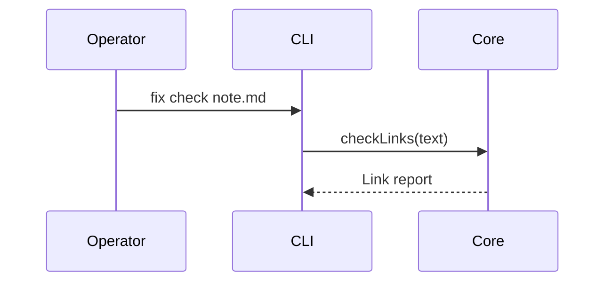

# Check Links

```mermaid
sequenceDiagram
  Operator->>CLI: fix check note.md
  CLI->>Core: checkLinks(text)
  Core-->>CLI: Link report
```

## Failure path
Unreadable target directories are reported as missing Links, not as crashes.
