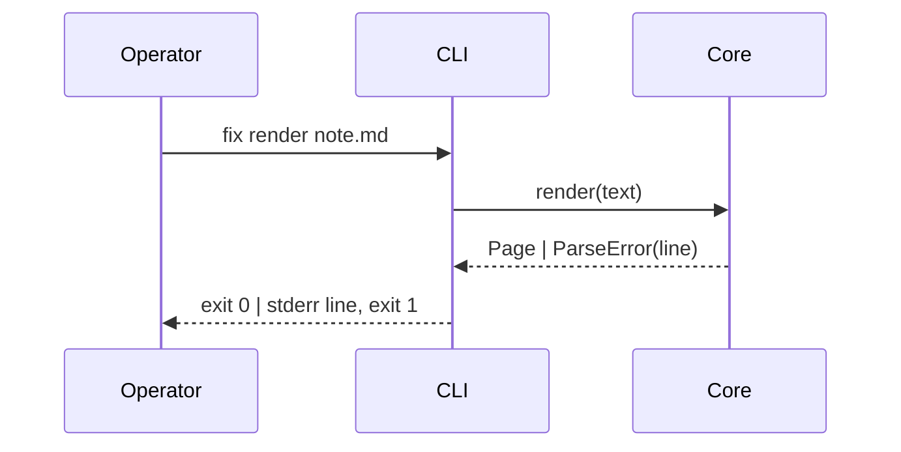

# Render a Note

```mermaid
sequenceDiagram
  Operator->>CLI: fix render note.md
  CLI->>Core: render(text)
  Core-->>CLI: Page | ParseError(line)
  CLI-->>Operator: exit 0 | stderr line, exit 1
```

## Failure path
A parse error reports the line and exits 1; nothing is written.
