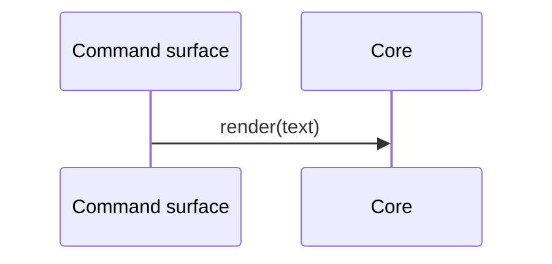

# Flow: render a Note

**Mapping:** E1.1 (render), E1.2 (parse errors).

## Behavior view

```mermaid
sequenceDiagram
    participant CS as Command surface
    participant CO as Core
    CS->>CO: render(text)
```

## Failure path

Parse error reports the line.
